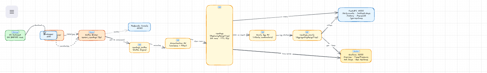
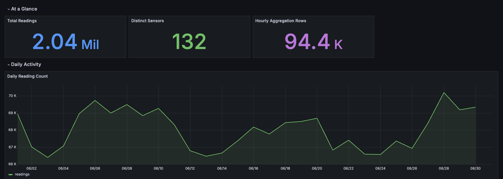
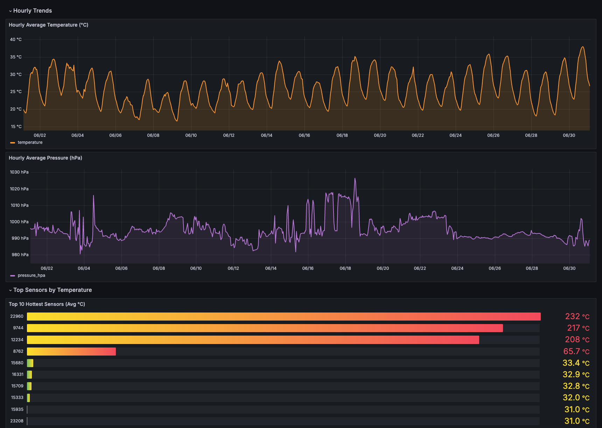
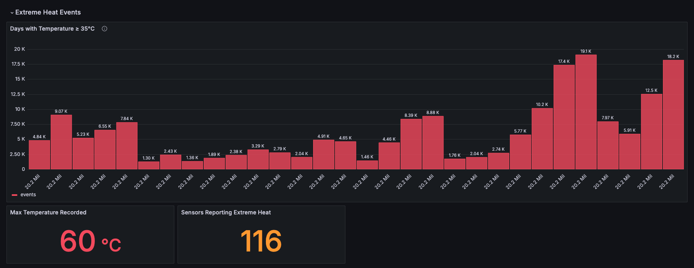
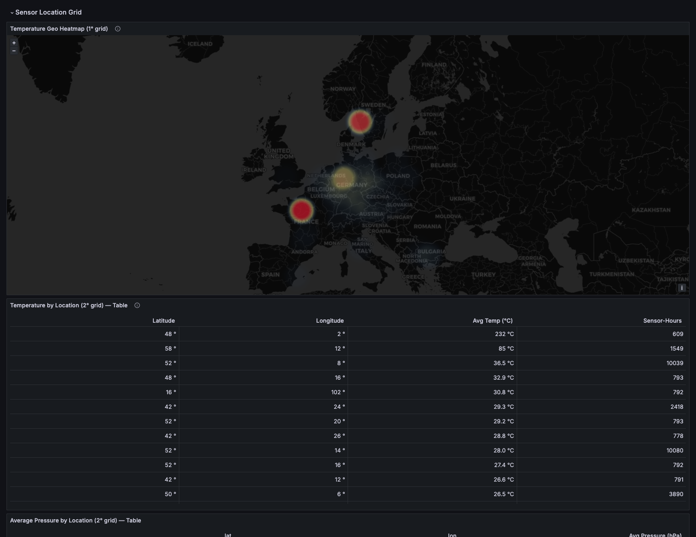
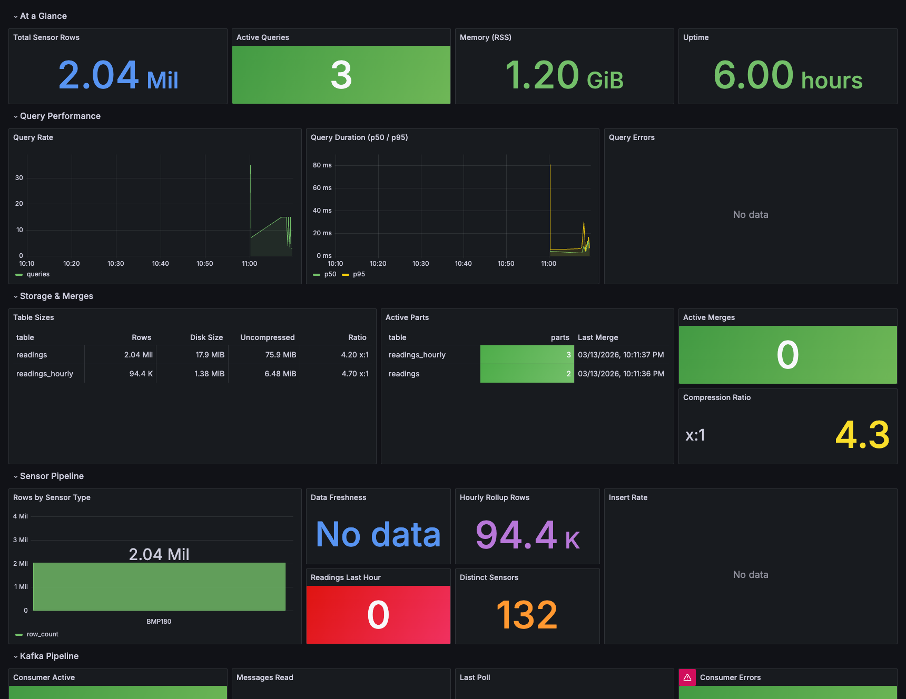

# SensorHouse

A sensor data ingestion and analytics platform built with Kafka, ClickHouse, FastAPI, and Grafana. It streams real-world environmental sensor data from the [Sensor.Community](https://sensor.community/) (formerly Luftdaten) open dataset, stores it in a columnar time-series database, and exposes it through a REST API and five Grafana dashboards.

## Architecture



> Source file: [`docs/architecture.excalidraw`](docs/architecture.excalidraw)

**Data flow:** S3 dataset → Python producer → Kafka topic → ClickHouse Kafka engine → `readings` table → hourly materialized view → FastAPI / Grafana

---

## What It Does

SensorHouse ingests temperature, pressure, humidity, and particulate matter (PM2.5/PM10) readings from hundreds of community air-quality sensors distributed across Europe. The pipeline:

1. **Loads 2M seed rows** from the Sensor.Community public S3 bucket (BMP180 sensors, June 2019) directly into ClickHouse using the native `s3()` table function.
2. **Streams live data** through a Python Kafka producer that replays the same dataset at configurable speed into a 3-partition Kafka topic.
3. **Ingests via Kafka engine** — ClickHouse's `Kafka` engine table and a Materialized View automatically consume and normalize messages into the main `readings` table.
4. **Pre-aggregates hourly** via a second Materialized View into `readings_hourly` (AggregatingMergeTree), so dashboard queries are fast without scanning raw rows.
5. **Serves analytics** through a FastAPI REST API with 5 endpoints covering daily counts, sensor history, extreme weather, PM2.5 rankings, and geographic heatmaps.
6. **Visualizes** data in Grafana with 5 pre-provisioned dashboards.

---

## The Data

**Source:** [Sensor.Community](https://sensor.community/en/) — a citizen science network of DIY air-quality sensors deployed on balconies and windows across Europe and beyond.

**Dataset used:** `2019-06_bmp180.csv.zst` from the public S3 bucket at `clickhouse-public-datasets.s3.eu-central-1.amazonaws.com`

| Field | Type | Description |
|---|---|---|
| `sensor_id` | UInt32 | Unique sensor identifier |
| `sensor_type` | LowCardinality(String) | Hardware model (e.g. `BMP180`) |
| `location` | UInt32 | Location identifier |
| `lat` / `lon` | Float32 | GPS coordinates |
| `timestamp` | DateTime | UTC reading timestamp |
| `temperature` | Float32 | Air temperature (°C) |
| `pressure` | Float32 | Atmospheric pressure (Pa) |
| `humidity` | Float32 | Relative humidity (%) |
| `P1` / `P2` / `P0` | Float32 | PM10 / PM2.5 / PM1 particulates (µg/m³) |

**Volume:** ~2,040,737 rows from 132 distinct sensors across June 2019.

---

## Stack

| Service | Image | Purpose | Port |
|---|---|---|---|
| Zookeeper | `confluentinc/cp-zookeeper:7.6.1` | Kafka coordination | — |
| Kafka | `confluentinc/cp-kafka:7.6.1` | Message broker | 9092 |
| Redpanda Console | `redpandadata/console:v2.6.0` | Kafka UI | 8080 |
| ClickHouse | `clickhouse/clickhouse-server:24.3` | Columnar time-series DB | 8123, 9000 |
| Grafana | `grafana/grafana:10.4.2` | Dashboards | 3000 |
| API | `./api` (FastAPI + uvicorn) | REST API | 8000 |
| Producer | `./kafka/producer` (Python) | Kafka data generator | — |

---

## Quick Start (from scratch)

### Prerequisites

- Docker Desktop (or Docker Engine + Compose plugin)
- `git`
- ~4 GB free disk space (ClickHouse data + Docker images)

### 1. Clone and configure

```bash
git clone <repo-url> sensorhouse
cd sensorhouse
cp .env.example .env
```

The `.env` file contains all credentials and is pre-filled with safe defaults. No changes needed for local development.

### 2. Start the stack

```bash
docker compose up -d --build
```

The startup sequence is orchestrated via healthchecks. Expected startup order:

```
zookeeper (healthy) → kafka (healthy) → clickhouse + redpanda-console
                                      ↳ grafana → api
```

**First boot takes ~90–120 seconds.** ClickHouse will automatically run all SQL init scripts in `clickhouse/init/` and load 2M rows from S3. Track progress:

```bash
# Watch all services become healthy
watch -n 3 'docker compose ps'

# Watch ClickHouse row count grow (starts at 0, reaches ~2M)
watch -n 5 "docker exec sensorhouse-clickhouse-1 clickhouse-client \
  --user default --password sensorhouse \
  --query 'SELECT count() FROM sensors.readings'"
```

### 3. Verify everything is running

```bash
# All 6 services should show "healthy" or "Up"
docker compose ps

# Run the test suites
bash tests/test_m1_infrastructure.sh   # 9 infrastructure smoke tests
bash tests/test_m2_schema.sh           # 9 ClickHouse schema tests
bash tests/test_m3_kafka.sh            # 10 Kafka pipeline tests (run after producer)
bash tests/test_m4_api.sh              # 16 API + Grafana tests
```

### 4. Run the Kafka producer

The producer streams 200,000 sensor rows from S3 into Kafka, which ClickHouse then consumes automatically:

```bash
docker compose run --rm producer
```

Watch the pipeline in real time:

```bash
# Row count should grow as ClickHouse consumes from Kafka
watch -n 2 "docker exec sensorhouse-clickhouse-1 clickhouse-client \
  --user default --password sensorhouse \
  --query 'SELECT count() FROM sensors.readings'"

# Check Kafka consumer lag (reaches 0 when producer is done)
docker exec sensorhouse-kafka-1 kafka-consumer-groups \
  --bootstrap-server localhost:9092 \
  --group clickhouse-consumer --describe
```

---

## Access Points

| Service | URL | Credentials |
|---|---|---|
| Grafana | http://localhost:3000 | `admin` / `sensorhouse` |
| API docs (Swagger) | http://localhost:8000/docs | — |
| API health | http://localhost:8000/health | — |
| Redpanda Console | http://localhost:8080 | — |
| ClickHouse HTTP | http://localhost:8123/ping | — |

---

## REST API Endpoints

All endpoints are documented interactively at http://localhost:8000/docs.

| Method | Path | Description |
|---|---|---|
| GET | `/health` | Liveness check |
| GET | `/health/db` | ClickHouse connectivity + row count |
| GET | `/api/v1/daily-counts` | Readings per day (params: `start`, `end`) |
| GET | `/api/v1/hottest-days` | Days with extreme heat+humidity (params: `min_temp`, `min_humidity`, `limit`) |
| GET | `/api/v1/sensors/{id}/history` | Time-series for one sensor (params: `start`, `end`, `metric`) |
| GET | `/api/v1/top-pm25` | Top locations by PM2.5 (params: `limit`, `start`, `end`) |
| GET | `/api/v1/geo-heatmap` | Lat/lon grid aggregation (params: `metric`, `resolution`, `start`, `end`) |

Example calls:

```bash
# Total readings and DB health
curl http://localhost:8000/health/db

# Daily reading counts for June 2019
curl "http://localhost:8000/api/v1/daily-counts?start=2019-06-01&end=2019-07-01"

# Sensor 15680 temperature history
curl "http://localhost:8000/api/v1/sensors/15680/history?metric=temperature&start=2019-06-01&end=2019-07-01"

# Top 10 most polluted locations
curl "http://localhost:8000/api/v1/top-pm25?limit=10"

# Geographic temperature heatmap at 2° resolution
curl "http://localhost:8000/api/v1/geo-heatmap?metric=temperature&resolution=2.0"
```

---

## Grafana Dashboards

All dashboards auto-provision on first boot via `grafana/provisioning/`. Access Grafana at http://localhost:3000 (`admin` / `sensorhouse`).

### SensorHouse Overview



Key metrics at a glance: total readings (2.04M), distinct sensors (132), hourly aggregation rows (94K), and a daily reading-count time series showing sensor network activity throughout June 2019.

### Temperature & Pressure Trends



Hourly average temperature and atmospheric pressure trends over the dataset window, plus a ranked bar gauge of the top 10 hottest sensors by average temperature.

### Hot Days



Extreme heat events: a bar chart of days where temperature ≥ 35°C, showing peak event counts per day. Stat panels show the max recorded temperature (60°C) and number of sensors reporting extreme heat (116).

### Geo Heatmap



A geographic heatmap of sensor temperature readings across Europe, plus a sortable table showing average temperature and pressure by lat/lon grid cell. The map shows sensor concentration in central Europe (Germany, France, Scandinavia).

### ClickHouse Monitoring



Internal ClickHouse health: total rows, active queries, memory usage (RSS), uptime, query rate/duration, table sizes with compression ratios (4.2–4.7×), active merge parts, and Kafka pipeline consumer stats (200K messages read, 2 active consumers).

---

## ClickHouse Schema

ClickHouse stores all sensor data in the `sensors` database. The schema is initialized automatically from scripts in `clickhouse/init/` in numbered order.

### `sensors.readings` — main table

```sql
ENGINE = ReplacingMergeTree(version)
PARTITION BY toYYYYMM(timestamp)
ORDER BY (sensor_id, timestamp)
```

- **ReplacingMergeTree(version)**: idempotent upserts — if the same `(sensor_id, timestamp)` is inserted twice, the row with the higher `version` wins during background merges. Kafka rows always win over seed rows because they use message timestamps as their version.
- **PARTITION BY month**: one partition per calendar month, enabling fast partition pruning and TTL drops.
- **ORDER BY (sensor_id, timestamp)**: primary key. `sensor_id` is the equality filter; `timestamp` is the range filter. This matches the most common query pattern.
- **No Nullable columns**: absent fields default to `0` instead of `NULL`, avoiding the overhead of null bitmaps.
- **LowCardinality(sensor_type)**: dictionary-encodes the ~10 distinct sensor type strings.
- **Skip index on sensor_type**: `TYPE set(50)` for fast equality filtering on a low-cardinality column.
- **TTL**: data older than 10 years is automatically expired during background merges.
- **Materialized `date` column**: `date Date MATERIALIZED toDate(timestamp)` — stored at insert time for zero-cost date filtering.

### `sensors.readings_hourly` — pre-aggregated rollup

```sql
ENGINE = AggregatingMergeTree()
PARTITION BY toYYYYMM(hour)
ORDER BY (sensor_id, hour)
```

Stores intermediate aggregation states for hourly rollups. Columns use `AggregateFunction(avg, Float32)` types — you query them with `-Merge` combinators:

```sql
SELECT hour,
       avgMerge(avg_temp)      AS temperature,
       avgMerge(avg_humidity)  AS humidity,
       sumMerge(sample_count)  AS n
FROM sensors.readings_hourly
WHERE sensor_id = 15680
  AND hour >= '2019-06-01'
GROUP BY hour
ORDER BY hour
```

### Materialized Views

| View | Source | Target | Trigger |
|---|---|---|---|
| `readings_hourly_mv` | `sensors.readings` | `sensors.readings_hourly` | Every INSERT into `readings` |
| `readings_kafka_mv` | `sensors.readings_kafka` | `sensors.readings` | Every Kafka message batch |

The Kafka MV normalizes nullable fields with `coalesce`, parses timestamp strings with `parseDateTimeBestEffort`, and filters out malformed rows before writing to the main table.

### Kafka engine table

`sensors.readings_kafka` is a virtual connector table — it does not store data. It connects ClickHouse to the `sensor_readings` Kafka topic using 2 consumer threads in the `clickhouse-consumer` group.

### Useful ClickHouse queries

```bash
# Connect to ClickHouse CLI
docker exec -it sensorhouse-clickhouse-1 clickhouse-client \
  --user default --password sensorhouse

# Row counts
SELECT count() FROM sensors.readings;
SELECT count() FROM sensors.readings_hourly;

# Table sizes and compression
SELECT table, formatReadableQuantity(sum(rows)) AS rows,
       formatReadableSize(sum(bytes_on_disk)) AS disk,
       formatReadableSize(sum(data_uncompressed_bytes)) AS uncompressed,
       round(sum(data_uncompressed_bytes)/sum(bytes_on_disk), 1) AS ratio
FROM system.parts
WHERE database = 'sensors' AND active
GROUP BY table;

# Distinct sensor types
SELECT sensor_type, count() FROM sensors.readings GROUP BY sensor_type;

# Temperature range check
SELECT min(temperature), max(temperature), avg(temperature)
FROM sensors.readings
WHERE temperature > 0;

# Hourly rollup sample
SELECT hour, round(avgMerge(avg_temp), 1) AS avg_temp, sumMerge(sample_count) AS n
FROM sensors.readings_hourly
WHERE sensor_id = 15680
GROUP BY hour
ORDER BY hour
LIMIT 24;
```

---

## Full Reset (clean slate)

To wipe all data and restart:

```bash
docker compose down -v          # removes containers AND volumes
docker compose up -d --build    # rebuilds from scratch
```

To only reset the Kafka pipeline (keep ClickHouse data):

```bash
# Truncate tables
docker exec sensorhouse-clickhouse-1 clickhouse-client \
  --user default --password sensorhouse \
  --query "TRUNCATE TABLE sensors.readings"

# Delete and recreate Kafka topic
docker exec sensorhouse-kafka-1 kafka-topics \
  --bootstrap-server localhost:9092 --delete --topic sensor_readings
docker exec sensorhouse-kafka-1 kafka-topics \
  --bootstrap-server localhost:9092 --create --topic sensor_readings \
  --partitions 3 --replication-factor 1

# Recreate Kafka engine table and MV
docker exec -i sensorhouse-clickhouse-1 clickhouse-client \
  --user default --password sensorhouse --multiquery \
  < clickhouse/init/06_create_kafka_table.sql
docker exec -i sensorhouse-clickhouse-1 clickhouse-client \
  --user default --password sensorhouse --multiquery \
  < clickhouse/init/07_create_kafka_mv.sql

# Re-run producer
docker compose run --rm producer
```

---

## Project Structure

```
sensorhouse/
├── api/                        # FastAPI application
│   ├── main.py                 # 7 REST endpoints
│   ├── db.py                   # ClickHouse client singleton
│   ├── Dockerfile
│   └── requirements.txt
├── clickhouse/
│   ├── config/users.xml        # ClickHouse user config
│   └── init/                   # SQL scripts (run in order on first boot)
│       ├── 01_create_database.sql
│       ├── 02_create_sensors_table.sql     # ReplacingMergeTree
│       ├── 03_create_hourly_table.sql      # AggregatingMergeTree
│       ├── 04_create_hourly_mv.sql         # Incremental pre-aggregation MV
│       ├── 05_load_sample.sql              # 2M rows from S3
│       ├── 06_create_kafka_table.sql       # Kafka engine connector
│       ├── 07_create_kafka_mv.sql          # Kafka → readings MV
│       └── 08_add_ttl.sql                  # 10-year data TTL
├── grafana/
│   └── provisioning/
│       ├── dashboards/         # 5 dashboard JSON files
│       └── datasources/        # ClickHouse datasource config
├── kafka/
│   └── producer/               # Python Kafka producer
├── docs/
│   ├── architecture.excalidraw # Architecture diagram source
│   └── screenshots/            # Dashboard screenshots
├── tests/                      # Bash test suites (M1–M4)
├── docker-compose.yml
└── .env.example
```

---

## Milestones

| # | Title | Key deliverable |
|---|---|---|
| 1 | Foundation & Infrastructure | Docker Compose stack, FastAPI `/health`, 9 smoke tests |
| 2 | ClickHouse Schema | `sensors.readings` + `readings_hourly` + materialized view, 2M seed rows, 9 schema tests |
| 3 | Kafka Ingestion Pipeline | Python producer, `readings_kafka` engine table + MV, end-to-end pipeline, 10 ingestion tests |
| 4 | REST API & Grafana Dashboards | 5 FastAPI endpoints, 5 Grafana dashboards, TTL, 16 API tests |
